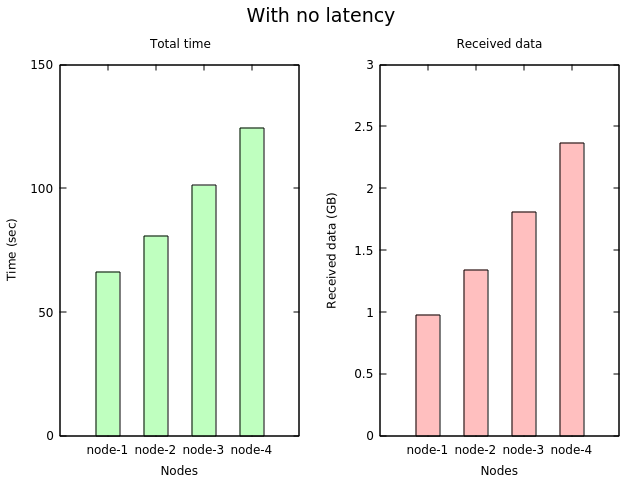
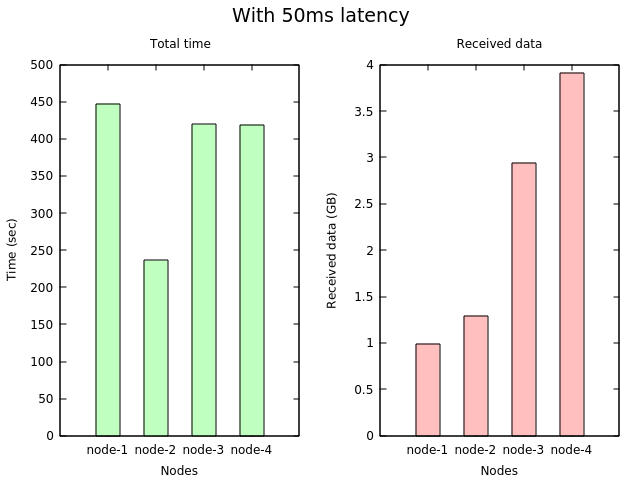

# IPFS-multi-sources-pull-issue
Demonstrate a scaling issue related to IPFS

## Description

I was playing with IPFS and I feel that I discovered a strange behavior! I have multiple machines, let's says 4, on the first one, I generated a random binary file and I added it to IPFS. On the second node, I pulled this file by its multihash. When the data is completely transferred to the second node, I repeated the same steps again on the third node, fourth node...

What I was excepting is that the time needed to pull the image for each node to be less than the time need by the previous ones, because the last started node has more sources that can supply the data and the node can pull the data in parallel. But what I experienced was different. Each new node takes more time than the previous ones! The reason is caused by the increasing amount of data sent over the network. It seems that the file is being pulled from **all** the other nodes. I verified that by observing the data size passing through the network interface.

I ran two experiments, the first one with no network latency, while the second emulates a 50ms network latency with jitter.

## The experiment

For the experiment, I use virtual machines (Vagrant with VirtualBox), but the same results are obtained using real physical machines also.

I use **5** nodes (the first node just create a random file and add it to the repository) with a file size of **1GB**.

All the parameters are specified in the `Vagrantfile.custom` file.

The received bytes are observed by reading the content of the file `/sys/class/net/$NET_INTERFACE/statistics/rx_bytes`. I double-checked these numbers using `ipfs stats bw` which print the received data size.


To run the VM, clone the repository and run

```
vagrant up
```

The results will be saved in `stats.csv`

Don't forget to destroy the VMs as they are no longer needed.

```
vagrant destroy -f
```

## Results

The following figure depicts the time needed for each node to pull the data (left), and the amount of received data (right).



As we can see, each node needs more time than the previous ones to pull the same amount of data.

> The relative values of time are more important than the absolute values.

The next figure shows the same trend for a network of 50ms latency.



> Repeating the same experiment might not give the same exact number but it will show the same trend.

## For Fun!

Any help to replicate the same experience using Docker containers is appreciated :)
